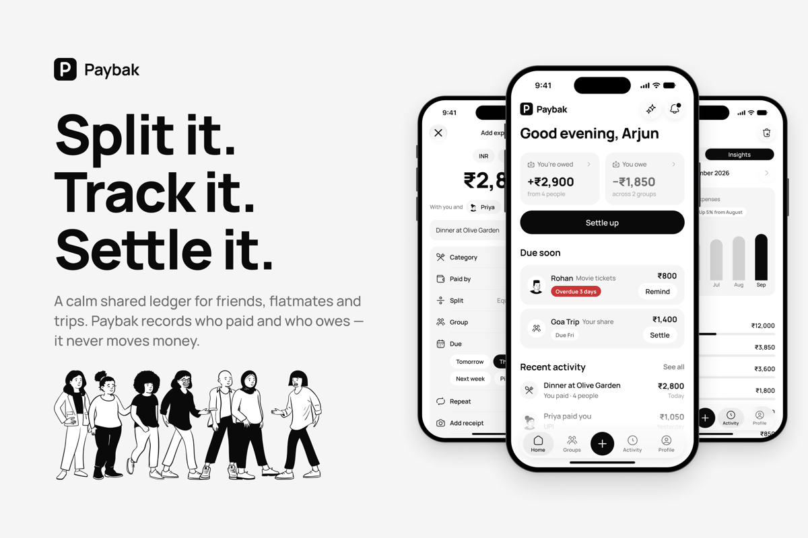
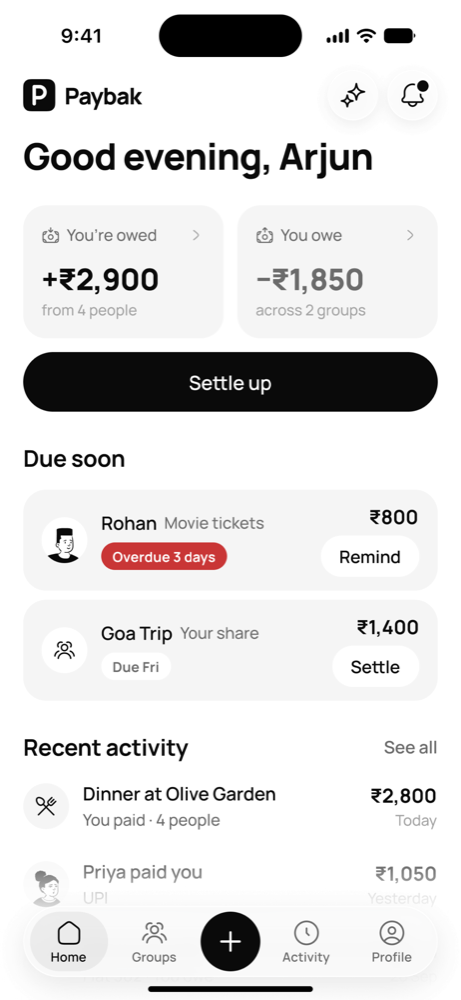
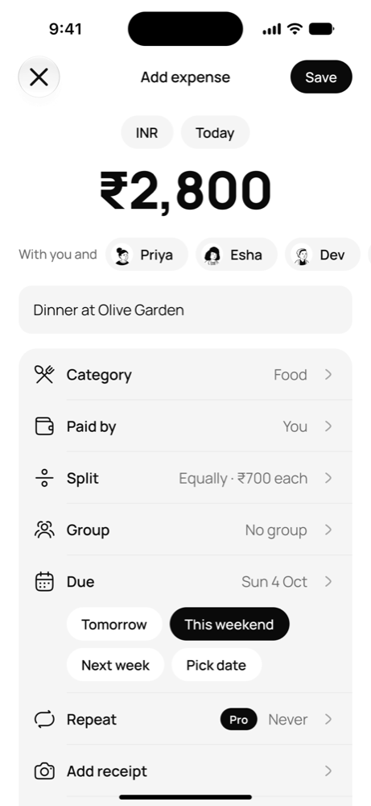
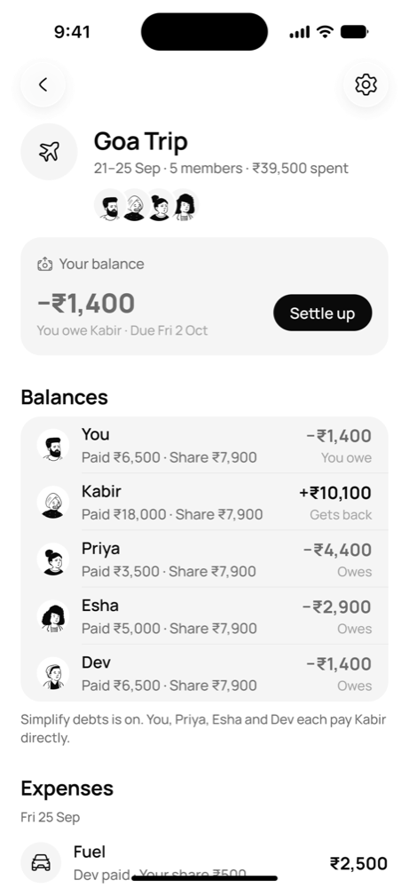
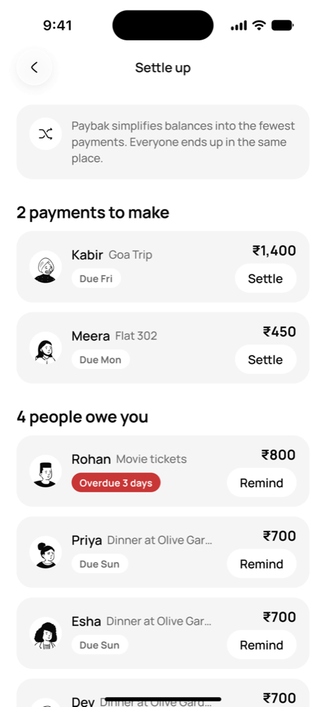
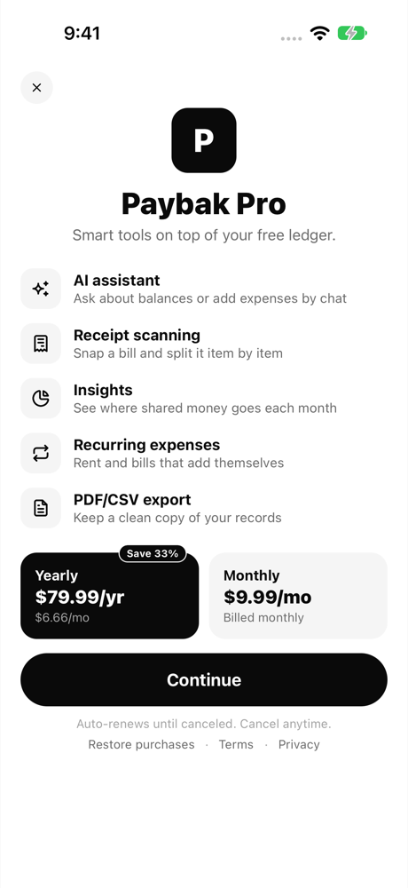
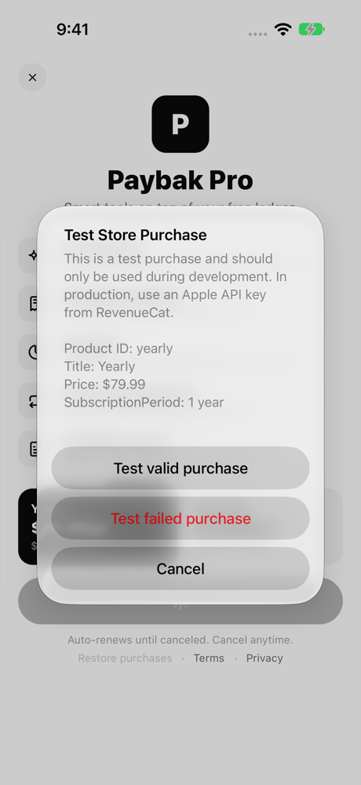
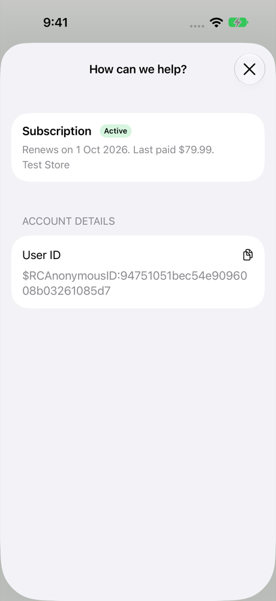

<p align="center">
  
</p>

<h1 align="center">Paybak</h1>

<p align="center">
  Split expenses with friends, groups and shared projects, and always know who owes whom.<br>
  Native <b>SwiftUI</b> (iOS) and <b>Jetpack Compose</b> (Android) apps. Paybak Pro is powered by <b>RevenueCat</b>.
</p>

<p align="center">
  <a href="LICENSE"></a>
  
  
  
</p>



## What it is

Splitting rent, trips and dinners with friends gets messy fast: group chats fill up with screenshots, small debts are forgotten, and asking for money feels awkward. Paybak is a calm ledger for shared money:

- **Add an expense** in a few taps and split it equally, by exact amounts, by shares or by percentages.
- **Groups, friends and projects** each get their own balance; everything converts to your default currency.
- **Settle up** and record payments; balances update instantly.
- **Activity, reminders and loans** keep the history clear.

The core ledger is free forever. **Paybak Pro** adds smart tools on top:

| Pro feature | What it does |
| --- | --- |
| AI assistant | Ask about balances, or add expenses by chat |
| Receipt scanning | Snap a bill and split it item by item |
| Insights | See where shared money goes each month |
| Recurring expenses | Rent and bills that add themselves |
| PDF/CSV export | Keep a clean copy of your records |

<p align="center">
  
  
  
  
</p>

There is **no backend**: all data is stored on the device. RevenueCat is the only network service, and it handles purchases and subscription status.

## Monetization with RevenueCat

Paybak Pro is a subscription sold through the [RevenueCat SDK](https://www.revenuecat.com/docs) on both platforms:

| Piece | Value |
| --- | --- |
| Entitlement | `paybak_pro` |
| Offering | `default` (current) |
| Packages | `$rc_monthly` → product `monthly`, `$rc_annual` → product `yearly` |
| Paywall | A [RevenueCat Paywall](https://www.revenuecat.com/docs/tools/paywalls) built in the dashboard, shown with RevenueCatUI |
| Subscription management | [Customer Center](https://www.revenuecat.com/docs/tools/customer-center) |
| Store | [RevenueCat Test Store](https://www.revenuecat.com/docs/test-and-launch/sandbox/test-store) in debug builds, so anyone can try the full purchase flow without an App Store or Google Play account |

<p align="center">
  
  
  
</p>

How it fits together:

1. The SDK is configured once at launch with anonymous app user IDs (there is no login, because there is no backend).
2. A small observable store listens to RevenueCat's `CustomerInfo` updates. **Pro is unlocked only while `paybak_pro` is active**, so the SDK is the single source of truth.
3. Every Pro feature goes through one gate (`requirePro`). Free users get the RevenueCat paywall; after a purchase or restore, the app continues straight to the feature they tapped.
4. Pro members can open **Manage subscription**, which shows RevenueCat's Customer Center.

Where the code lives:

| | iOS | Android |
| --- | --- | --- |
| SDK config and API key | `ios/paybak/paybak/Purchases/RevenueCatConfig.swift` | `android/app/build.gradle.kts` (`REVENUECAT_API_KEY`) and `RevenueCatConfig` in `billing/SubscriptionRepository.kt` |
| Customer info and entitlement | `ios/paybak/paybak/Purchases/SubscriptionStore.swift` | `android/app/src/main/java/app/paybak/paybak/billing/SubscriptionRepository.kt` |
| Paywall | `ios/paybak/paybak/Features/Pro/PaywallScreen.swift` | `android/app/src/main/java/app/paybak/paybak/feature/pro/PaywallScreen.kt` |
| Pro status and Customer Center | `ios/paybak/paybak/Features/Pro/ProWelcomeView.swift` | `android/app/src/main/java/app/paybak/paybak/feature/pro/ProWelcome.kt` |

The full step-by-step setup (dashboard, code, error handling, going to production) is in [`docs/revenuecat.md`](docs/revenuecat.md).

## Run it

Debug builds are wired to Paybak's RevenueCat **Test Store** key, so purchases work out of the box: when you buy Pro, the SDK shows a test purchase sheet where you choose a successful, failed or cancelled purchase. No real money is involved.

> Test Store keys only work in **debug** builds. The RevenueCat SDK deliberately crashes a release build that uses a Test Store key, so release builds read an empty store key until you add your own (see [`docs/revenuecat.md`](docs/revenuecat.md#going-to-production)).

### iOS

Requirements: Xcode 27 or later, iOS 26 or later (simulator or device).

```sh
open ios/paybak/paybak.xcodeproj
```

Pick the `paybak` scheme and run. Swift Package Manager fetches RevenueCat and Rive on the first build. To run on a device, set your own team under *Signing & Capabilities*.

### Android

Requirements: Android Studio (latest stable) with JDK 17 or later, and Android 7.0 (API 24) or later.

```sh
cd android
./gradlew installDebug
```

Or open `android/` in Android Studio and run the `app` configuration.

### Try Pro

1. Finish onboarding: any name works, and the email or phone code is `000000`.
2. Tap any Pro feature, for example **Insights** or the ✨ **Ask Paybak** button on Home, or open **Profile › Paybak Pro**.
3. Pick a plan on the RevenueCat paywall and confirm the test purchase.
4. The feature unlocks. Open **Profile › Paybak Pro › Manage subscription** to see the Customer Center.

### Debug tools (debug builds only)

- Long-press the Paybak logo on Home to open the debug menu: load the demo dataset, toggle Pro locally, reset onboarding and more.
- Launch arguments jump straight to a screen. iOS: `-startScreen <id>` and `-pro YES|NO`. Android: `--es startScreen <id>` and `--es pro YES|NO`. Screen ids are listed in [`docs/design/`](docs/design/README.md).

## Repository layout

| Folder | Contents |
| --- | --- |
| `ios/` | SwiftUI app (Observation, Swift Testing, XCUITest) |
| `android/` | Kotlin + Jetpack Compose app (Compose UI tests) |
| `docs/design/` | The design spec both apps are built from: screens, components, tokens, domain model, and a demo dataset that reproduces the design's numbers |
| `docs/revenuecat.md` | RevenueCat integration guide |
| `web/` | Early web client, in progress (not part of the mobile apps) |

## Tests

```sh
# iOS unit tests
xcodebuild test -project ios/paybak/paybak.xcodeproj -scheme paybak \
  -destination 'platform=iOS Simulator,name=iPhone 18 Pro' -only-testing:paybakTests

# Android unit tests
cd android && ./gradlew testDebugUnitTest
```

## Built for Shipaton 2026

Paybak is an entry in [RevenueCat Shipaton 2026](https://revenuecat-shipaton-2026.devpost.com/) for the **Next Gen Award**. The whole app, including the RevenueCat integration, is open source under the MIT license.

## License and credits

- Paybak is released under the [MIT License](LICENSE). See also the [privacy policy](docs/privacy.md) and [terms](docs/terms.md), which the paywall links to.
- [Manrope](https://github.com/googlefonts/manrope) font, © The Manrope Project Authors, [SIL Open Font License 1.1](docs/licenses/Manrope-OFL.txt).
- Animations run on the [Rive](https://rive.app) runtime ([rive-ios](https://github.com/rive-app/rive-ios), [rive-android](https://github.com/rive-app/rive-android)).
- Purchases by [RevenueCat](https://www.revenuecat.com) ([purchases-ios](https://github.com/RevenueCat/purchases-ios), [purchases-android](https://github.com/RevenueCat/purchases-android)).
